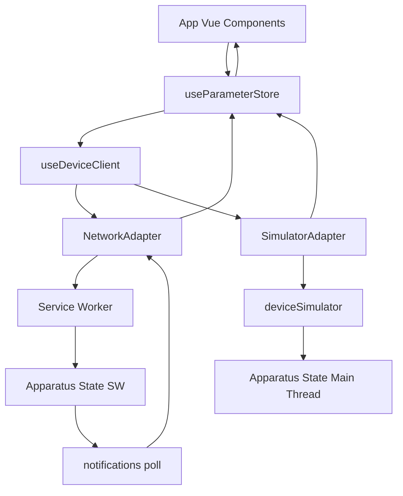
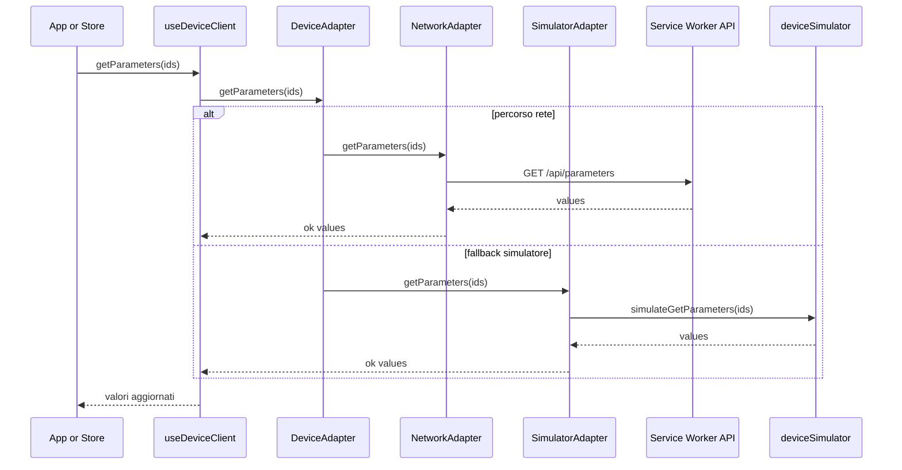
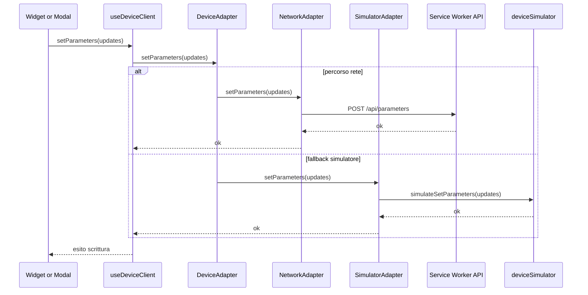
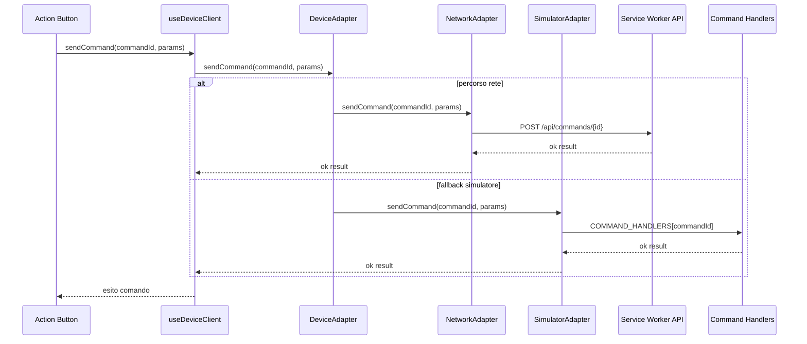
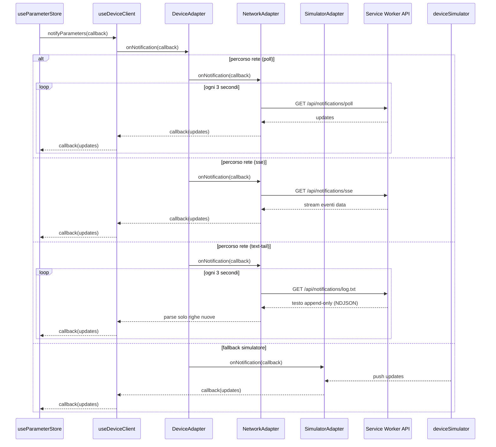
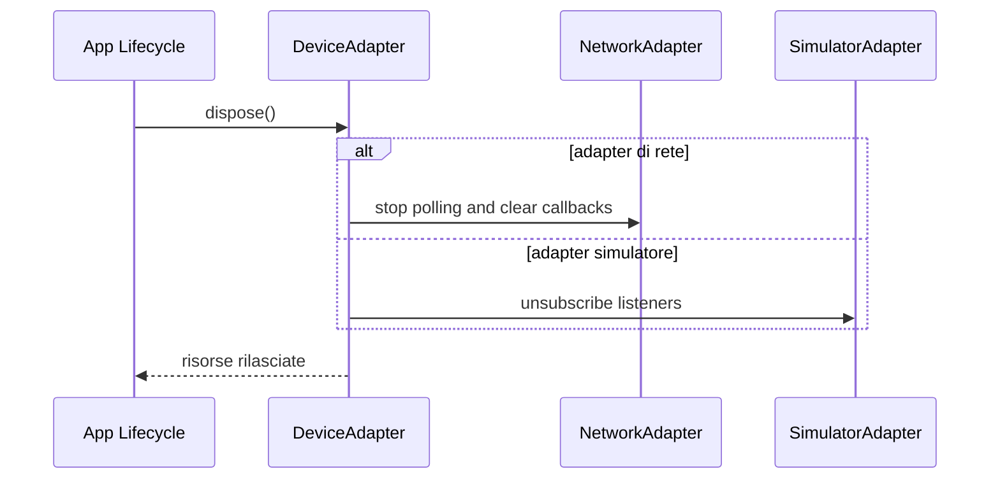

# hmi-demo

Demo HMI sviluppata con Vue 3 e Vite per simulare un pannello veicolo 800x600 con menu gerarchici, widget parametro e stato apparato aggiornato in modo asincrono.

## Stato attuale del progetto (Aprile 2026)

- UI Vue 3 basata su composable singleton per menu, parametri, notifiche e tema.
- Configurazione menu e pagine da YAML (`src/config/platform.yaml` + `includes`).
- Supporto pagine transaction con draft locali, submit ottimistico e rollback su errore.
- Client apparato con percorso standard `NetworkAdapter` (nessuna customizzazione codice richiesta se il backend espone le stesse API `/api/*`).
- `SimulatorAdapter` disponibile solo come modalita esplicita per dev/test.
- Simulazione apparato disponibile in due esecuzioni equivalenti:
  - thread Service Worker (`public/sw.js`) su chiamate `/api/*`.
  - main thread (`src/composables/deviceSimulator.js`) tramite adapter diretto.
- Comandi supportati: `RESET_ALARMS`, `GPS_RESET`, `REBOOT`.

## Requisiti

- Node.js 20.19+ oppure 22.12+
- npm

## Avvio

```sh
npm install
npm run dev
```

Build di produzione:

```sh
npm run build
```

## Architettura

- `src/App.vue`: shell principale, griglie dei widget, barra di stato e modali di editing.
- `src/composables/useMenuConfig.js`: parsing e normalizzazione del menu YAML.
- `src/composables/useMenuNavigation.js`: stato singleton della navigazione tra primo e secondo livello.
- `src/composables/useParameterStore.js`: stato reattivo dei parametri e sincronizzazione con il client apparato.
- `src/composables/useDeviceClient.js`: client async verso apparato con adapter selezionabile via env (default rete).
- `src/adapters/NetworkAdapter.js`: adapter HTTP `/api/*`, con trasporto notifiche configurabile (`poll`, `sse`, `text-tail`).
- `src/adapters/SimulatorAdapter.js`: fallback diretto al simulatore locale (senza rete).
- `src/composables/deviceSimulator.js`: simulatore apparato in main thread (stato, latenza, notifiche periodiche).
- `public/sw.js`: simulatore apparato in Service Worker, con routing API e coda aggiornamenti pending.
- `src/components/`: widget, modali e icone usati dall'interfaccia.

## Diagramma architettura applicazione



## Simulazione: comportamento e flussi

### 1) Flusso standard rete (default)

- `useDeviceClient` usa `NetworkAdapter` per default.
- Le chiamate `getParameters`, `setParameters`, `sendCommand` passano da fetch su `/api/*`.
- Con backend reale: le stesse chiamate raggiungono direttamente il server apparato.
- Con simulatore SW attivo: `public/sw.js` intercetta le richieste, aggiorna lo stato apparato e accumula delta.
- Il trasporto notifiche e configurabile:
  - `poll`: polling ogni 3s su `/api/notifications/poll`
  - `sse`: stream server-initiated su `/api/notifications/sse`
  - `text-tail`: lettura continua di un file testuale append-only su `/api/notifications/log.txt`

### 2) Flusso simulatore diretto (opzionale)

- `useDeviceClient` usa `SimulatorAdapter` solo se configurato esplicitamente.
- Le chiamate arrivano direttamente a `deviceSimulator.js` nel main thread.
- Il simulatore applica latenza artificiale, muta lo stato e invia notifiche ai subscriber.

### Dinamiche simulate principali

- aggiornamento uptime periodico
- deriva temperatura/voltaggio/CPU
- drift posizione GPS e variazione satelliti/accuratezza
- decremento occasionale carburante e allarme soglia
- stato login derivato da credenziali (`admin` / `admin`)

## Diagrammi di sequenza per metodi interfaccia adapter

Interfaccia di riferimento: `DeviceAdapter` in `src/adapters/DeviceAdapter.js`.

### 1) getParameters(ids)



### 2) setParameters(updates)



### 3) sendCommand(commandId, params)



### 4) onNotification(callback)



### 5) dispose()



## Configurazione adapter e simulatore

Configurazione tramite variabili ambiente Vite (file `.env*`):

- `VITE_DEVICE_ADAPTER_MODE=network-auto` (default): usa sempre `NetworkAdapter`.
- `VITE_DEVICE_ADAPTER_MODE=simulator-direct`: forza `SimulatorAdapter` diretto.
- `VITE_DEVICE_API_BASE_URL=http://host:port` (opzionale): base URL backend reale; se omessa usa same-origin.
- `VITE_DEVICE_NOTIFICATION_TRANSPORT=poll|sse|text-tail` (default `text-tail`): seleziona il canale notifiche del `NetworkAdapter`.
- `VITE_DEVICE_NOTIFICATION_TEXT_URL=/api/notifications/log.txt` (opzionale): URL del file testuale append-only usato da `text-tail`.
- `VITE_ENABLE_SW_SIMULATOR=true` (default): registra `public/sw.js` che intercetta `/api/*` per la simulazione.
- `VITE_ENABLE_SW_SIMULATOR=false`: non registra il Service Worker simulatore.

Esempio backend reale senza customizzazione codice app (API compatibili):

```env
VITE_DEVICE_ADAPTER_MODE=network-auto
VITE_DEVICE_API_BASE_URL=http://192.168.1.100:8080
VITE_DEVICE_NOTIFICATION_TRANSPORT=text-tail
VITE_DEVICE_NOTIFICATION_TEXT_URL=/api/notifications/log.txt
VITE_ENABLE_SW_SIMULATOR=false
```

### Setup rapido con `.env.example`

Nel repository e incluso un file `.env.example` con tre profili pronti:

- Profile A: rete standard + simulatore Service Worker
- Profile B: simulatore diretto (main thread)
- Profile C: backend reale

Procedura consigliata:

1. Copia `.env.example` in `.env.local`.
2. Lascia attivo un solo profilo (gli altri restano commentati).
3. Riavvia `npm run dev` dopo ogni modifica alle variabili.

### Troubleshooting backend reale

Se il frontend non comunica con il backend reale, verifica nell'ordine:

1. Variabili ambiente: `VITE_DEVICE_ADAPTER_MODE=network-auto`, `VITE_ENABLE_SW_SIMULATOR=false`, `VITE_DEVICE_API_BASE_URL` corretto.
2. Reachability endpoint: il backend risponde su `GET /api/parameters?ids=uptime`.
3. CORS (se host/porta diversi): il backend deve consentire origine frontend, metodi `GET,POST`, header `Content-Type`.
4. Contratto API: payload compatibile con `DeviceAdapter` (`{ ok: true, ... }` oppure `{ ok: false, code, message }`).
5. Cache Service Worker: se avevi simulatore attivo in precedenza, fai hard reload e verifica in DevTools che il SW non stia controllando la pagina.

Errori frequenti e azioni consigliate:

- `NETWORK_ERROR`: URL backend errato, host non raggiungibile o CORS bloccato.
- `Errore HTTP 404 da .../api/...`: route API mancante o prefisso path non allineato.
- `Errore applicativo da ...`: backend ha risposto con `ok: false`; controllare `code`/`message` nel payload risposta.
- polling notifiche senza update: verificare implementazione di `GET /api/notifications/poll` e formato `{ ok: true, updates: {...} }`.
- SSE senza eventi: verificare endpoint `GET /api/notifications/sse`, header `text/event-stream` e frame `data: {...}`.
- text-tail senza aggiornamenti: verificare endpoint testuale append-only e URL `VITE_DEVICE_NOTIFICATION_TEXT_URL`.

Diagnosi rapida in browser:

1. Apri DevTools Network.
2. Filtra per `/api/`.
3. Controlla status HTTP e corpo JSON delle chiamate `parameters`, `commands`, `notifications/poll`.
4. Verifica in Console i log `[DeviceClient]` per correlare richiesta e risposta.

## Componenti da sostituire per apparato reale

### Sostituzione obbligatoria

- `public/sw.js`: da rimuovere dal percorso runtime reale o lasciare solo in sviluppo.
- `src/composables/deviceSimulator.js`: non deve piu essere sorgente dati in produzione.
- `src/adapters/SimulatorAdapter.js`: mantenere solo come fallback dev/test.

### Componenti da implementare o adattare

- `src/adapters/NetworkAdapter.js`: mantenere il contratto API `/api/*`; aggiungere policy reali (autenticazione, timeout, retry) senza cambiare interfaccia applicativa.
- Backend API apparato reale: deve esporre endpoint compatibili:
  - GET `/api/parameters?ids=...`
  - POST `/api/parameters`
  - POST `/api/commands/:commandId`
  - GET `/api/notifications/poll` oppure canale push equivalente
- `src/composables/useDeviceClient.js`: interfaccia gia stabile; selezione adapter e endpoint sono configurabili da env.

### Componenti riusabili senza modifiche strutturali

- `src/composables/useParameterStore.js`
- `src/components/*`
- `src/composables/useMenuConfig.js` e YAML in `src/config/*`

Questi moduli restano stabili se il contratto `DeviceAdapter` non cambia.

## Configurazione menu

La struttura del menu applicativo e i parametri visualizzati sono definiti in `src/config/platform.yaml`.

`platform.yaml` e il file padre e include i file figli con prefisso `platform-` nella stessa cartella, ad esempio:

- `platform-status-icons.yaml`
- `platform-pages-menu.yaml`
- `platform-pages-allarmi.yaml`
- `platform-pages-info.yaml`
- `platform-pages-impostazioni.yaml`

Ogni pagina puo contenere:

- `id`, `label`, `icon`
- `parameters`
- `submenus`

Per le pagine transaction (`mode: transaction`) e possibile aggiungere:

- `goOnApply`: comportamento dopo submit andato a buon fine
  - `STAY_HERE`: resta sulla pagina corrente (default)
  - `GO_HOME`: torna alla home
  - `GO_BACK`: torna alla pagina visitata in precedenza

Le pagine foglia visualizzano i parametri. Le pagine con `submenus` aprono invece il secondo livello di navigazione.

## Parametri supportati

I parametri dichiarati nel file YAML supportano questi tipi:

- `boolean`
- `number`
- `percentage`
- `enum`
- `text`
- `password`
- `date`

I valori sono inizializzati dal client simulato e poi aggiornati tramite notifiche periodiche o comandi inviati dall'interfaccia.

## Login simulato

Il simulatore parte in stato `unlogged` (icona login in stato `off`).
Quando riceve credenziali corrette passa a `logged` (icona login in stato `ok`).

Credenziali del simulatore:

- Name: `admin`
- Password: `admin`
